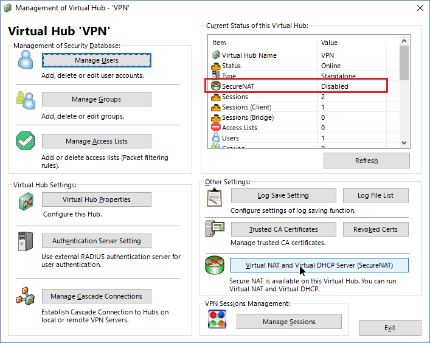
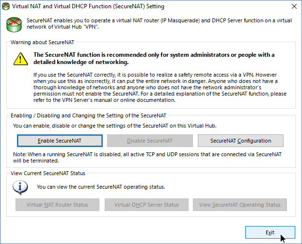

# <a href="/linux/centos" class="nav-button transform"><span></span></a>SoftEther VPN on a CentOS 7 VPS Using Local Bridge + DNSmasq (DHCP) + CSF Firewall

---

<nav class="breadcrumb is-medium" aria-label="breadcrumbs">
  <ul>
    <li><a href="/"><span class="icon is-small"><i class="fa fa-home"></i></span>Home<span></span></a></li>
    <li><a href="/linux"><span class="icon is-small"><i class="fa fa-linux"></i></span><span>Linux</span></a></li>
    <li><a href="/linux/centos"></i></span><span>CentOS</span></a></li>
    <li><a href="#"></i></span><span>SoftEther VPN on a CentOS 7 VPS Using Local Bridge + DNSmasq (DHCP) + CSF Firewall</span></a></li>
  </ul>
</nav>

---

## Introduction.

Setup Guide for SoftEther VPN Server on CentOS 7, SecureNAT of SoftEther VPN Server which includes DHCP will be disabled, DNSmasq with its DHCP will be used instead. A guide for Firewall CSF will also be provided to enable NAT in the `/etc/csf/csfpre.sh`, and some rules to allow access on the Internet with different protocols (OpenVPN & SoftEther Client).

#### What's SoftEther ?

SoftEther is a powerful multi-protocol VPN software and easy to use. He is compatible with all operatins systems (**Windows**, **Linux**, **Mac**, **FreeBSD**, **Solaris**...).
A very good thing with SoftEther is that it is an open source, so we can use it for any personal or commercial use for free charge without limitation in connections.
It is compatible with **OpenVPN**, **L2TP/IPsec**, **SSTP** protocols. SoftEther has also his own protocol VPN that is faster than OpenVPN, L2TP/IPsec and SSTP protocols.

#### Why a Local Bridge with DNSmasq (DHCP) ?

The SecureNAT of SoftEther VPN Server include a DHCP, it is known that it is a component which uses too much ressources like the CPU, and the Speed Connection is slower with it, that's why, the Local Bridge with the DHCP of DNSmasq is better.

#### Prerequisites.

Requirement : VPS on CentOS 7. Why I choose CentOS ?

The main reason is that I have my domain on it, and I installed a LEMP stack auto installer that is [CENTMIN MOD](http://centminmod.com/) that is for me the best LEMP currently available. If you are interested about it, I wrote an article about it : [LEMP WEB STACK - CentminMod - CentOS 7 - YUM Updates Auto](/linux/centos/centmin-mod-lemp-web-stack-yum-updates-auto-centos-7).

I have my VPS from Vikinglayer for 30E/year, the specifications of my VPS are :


* RAM: 2GB
* Burst: 3GB
* Disk Space: 60GB SSD
* Bandwidth: 1TB @ 1Gbit
* Location: Buffalo, USA

#### Yum Update.

Always important to update your System before installing anything.

``` sh
yum -y update && yum -y upgrade
```

## Installation of SoftEther Server VPN on a CentOS 7 VPS.

Go to the website of SoftEther and search the last version of **SoftEther Server** for **Linux Plateform** with the **CPU Intel x64/AMD64** in my case or if you use **x32 bits CPU** choose the good version.

The version which I will install is : **SoftEther VPN 4.24 Build 9652 Beta (December 21, 2017).**

After the download, exctract it & make it :

```
wget http://www.softether-download.com/files/softether/v4.24-9652-beta-2017.12.21-tree/Linux/SoftEther_VPN_Server/64bit_-_Intel_x64_or_AMD64/softether-vpnserver-v4.24-9652-beta-2017.12.21-linux-x64-64bit.tar.gz
tar -xzf softether-vpnserver-v4.24-9652-beta-2017.12.21-linux-x64-64bit.tar.gz
cd vpnserver
make
```


Move the whole folder `vpnserver/` to the directory `/usr/local` & attribute these permissions :

```
cd ..
mv vpnserver/ /usr/local
chmod 600 * /usr/local/vpnserver/
chmod 700 /usr/local/vpnserver/vpncmd && chmod 700 /usr/local/vpnserver/vpnserver
```


Write a Startup Script to register vpnserver to Linux as a daemon process, the bellow lines will write automatically the script so we can just copy and paste these lines :

```
echo '#!/bin/sh
# description: SoftEther VPN Server
### BEGIN INIT INFO
# Provides:          vpnserver
# Required-Start:    $local_fs $network
# Required-Stop:     $local_fs
# Default-Start:     2 3 4 5
# Default-Stop:      0 1 6
# Short-Description: softether vpnserver
# Description:       softether vpnserver daemon
### END INIT INFO
DAEMON=/usr/local/vpnserver/vpnserver
LOCK=/var/lock/subsys/vpnserver
TAP_ADDR=192.168.7.1

test -x $DAEMON || exit 0
case "$1" in
start)
$DAEMON start
touch $LOCK
sleep 1
/sbin/ifconfig tap_tapvpn $TAP_ADDR
;;
stop)
$DAEMON stop
rm $LOCK
;;
restart)
$DAEMON stop
sleep 3
$DAEMON start
sleep 1
/sbin/ifconfig tap_tapvpn $TAP_ADDR
;;
*)
echo "Usage: $0 {start|stop|restart}"
exit 1
esac
exit 0' > /etc/init.d/vpnserver
```

Make sure that the file is created correctly with `cat` :

```
cat /etc/init.d/vpnserver
```

The file is created correctly, so attribute new permission to this file, add this service to the auto start boot and enable it :

```
chmod 755 /etc/init.d/vpnserver
chkconfig --add vpnserver
chkconfig vpnserver on
/etc/init.d/vpnserver start
```

Special message after starting the service, no worries, that's normal, because we will configure a local bridge on the VPN SoftEther Server, at the moment the virtual interface is not yet created :

```
The SoftEther VPN Server service has been started.
SIOCSIFADDR: No such device
tap_tapvpn: ERROR while getting interface flags: No such device
```


## Finalization & Configuration of SoftEther Server VPN.


To finish and configure SoftEther Server VPN, the Manager SoftEther Server VPN Software for Windows will be use (also available for Linux, Mac...), downloadable on the website of [SoftEther](http://www.softether-download.com/en.aspx?product=softether) :


Install the SoftEther VPN Server Manager :


Create a `New Setting` for to be able to connect to the SoftEther VPN Server and manage it :


Fill the different informations and leave blank the password, `Connect` to it, the software will ask us to set a new password for the SoftEther VPN Server :


In our case, the purpose is to have a `Remote Access VPN Server`, so check it, `Next` and confirm the message box that will appears :


Let the `Virtual Hub Name`, or change it if you prefer :


Dynamic DNS Function appears, a good thing if your ISP assigns you a not fixed IP, or if you have only a private IP :


Check `Enable L2TP Server Function`, verify that the good Virtual Hub is choose and let or change the IPsec `Pre-Shared Key` :


Disable VPN Azure :


Create Users that you want and Close :


Create a new Local Bridge in `Local Bridge Setting` :


The SecureNAT is disable, because the DHCP of DNSmasq will be use instead :






## Installation & Configuration of DNSmasq for a DHCP.

```
yum install dnsmasq -y
```

Edit `/etc/dnsmasq.conf` and add these lines at the end :

```
nano /etc/dnsmasq.conf
```

```
interface=tap_tapvpn
dhcp-range=tap_tapvpn,192.168.7.50,192.168.7.60,12h
dhcp-option=tap_tapvpn,3,192.168.7.1
port=0 
dhcp-option=option:dns-server,208.67.222.222,208.67.220.220
```

Add the file `ipv4_forwarding.conf` in the directory `/etc/sysctl.d/`  with the line `net.ipv4.ip_forward = 1`, just copy and past the below line, it will create the file automatically :

```
echo 'net.ipv4.ip_forward = 1' > /etc/sysctl.d/ipv4_forwarding.conf
```

Make sure that the file is created correctly :

```
 cat /etc/sysctl.d/ipv4_forwarding.conf
 ```

Type the command to enable it :

```
sysctl --system
```

Restart VPNserver & DNSmasq service :

```
service dnsmasq restart && service vpnserver restart
```

## Configuration Firewall CSF for that the client OpenVPN & SoftEther works.

Copy and paste these lines for create `/etc/csf/csfpre.sh`, it allows to access on the Internet with OpenVPN & SoftEther Client, don't forget to change `YOURIPVPS` :

```
echo 'iptables -A FORWARD -m state --state RELATED,ESTABLISHED -j ACCEPT
iptables -A FORWARD -s 192.168.7.0/24 -j ACCEPT
iptables -A FORWARD -j REJECT
iptables -t nat -A POSTROUTING -s 192.168.7.0/24 -j SNAT --to-source YOURIPVPS' > /etc/csf/csfpre.sh
```

Make sure that the file is created correctly :

```
 cat /etc/csf/csfpre.sh
 ```

## Conclusion.


SoftEther VPN Server is very easy to install and support the most common protocols, no needed anymore to install different Server Solution VPN, we have all protocols in One Solution, the management of users is easy too.
Personally I use OpenVPN protocol.

To be honest I have some problems with the client SoftEther. When I try to connect with the Client SoftEther while CSF is enable I have this message :


However when I disable CSF,  the SoftEther VPN Client is able to connect, I have to find what is blocking it exactly, I will do some investigations and of course will write here when I will find the solution.


Otherwise the SoftEther VPN Server works perfectly and doesn't use a lot of CPU at all.

## Resolution of the connection with the VPN Client SoftEther.

As I said before, I had a problem when I tried to connect with the SoftEther VPN Client with CSF enable, so I tried to capture with Wireshark a trame while I was trying to connect with the SoftEther VPN Client, we can see some troubles at the begin of the trame when The client send packet with UDP 63803 to Server's UDP 40000 Port :


Another capture, but with CSF disable, we notice that every time the SoftEther VPN Client tries to connect to the Server VPN, it sends a UDP packet with a random port 50000-65535 to the same UDP 4000 port of the SoftEther Server VPN :


So it is just necessary to open `UDP_OUT = "40000:65535"` & `UDP_IN = "40000"`, here what I have exactly in my `csf.conf` :

```
# Allow incoming TCP ports
TCP_IN = "20,21,22,25,53,80,110,143,161,443,465,587,993,995,1110,1186,1194,81,9418,30001:50011"

# Allow outgoing TCP ports
TCP_OUT = "993,995,465,587,1110,1194,9418,20,21,22,25,53,80,110,113,443,587,993,995"

# Allow incoming UDP ports
UDP_IN = "40000,67,68,500,4500,1110,33434:33534,20,21,53"

# Allow outgoing UDP ports
# To allow outgoing traceroute add 33434:33523 to this list 
UDP_OUT = "40000:65535,67,68,500,4500,1110,33434:33534,20,21,53,113,123"
```

And something important, without this, it will be impossible to access on the Internet, the `/etc/csf/csfpre.sh`, Copy and paste these lines for create it, don't forget to change `YOURIPVPS` :

```
echo 'iptables -A FORWARD -m state --state RELATED,ESTABLISHED -j ACCEPT
iptables -A FORWARD -s 192.168.7.0/24 -j ACCEPT
iptables -A FORWARD -j REJECT
iptables -t nat -A POSTROUTING -s 192.168.7.0/24 -j SNAT --to-source YOURIPVPS' > /etc/csf/csfpre.sh
```

Make sure that the file is created correctly :

```
 cat /etc/csf/csfpre.sh
 ```


To finish restart SoftEther VPN Server, DNSmasq and CSF :

```
csf -r && service dnsmasq restart && service vpnserver restart
```
