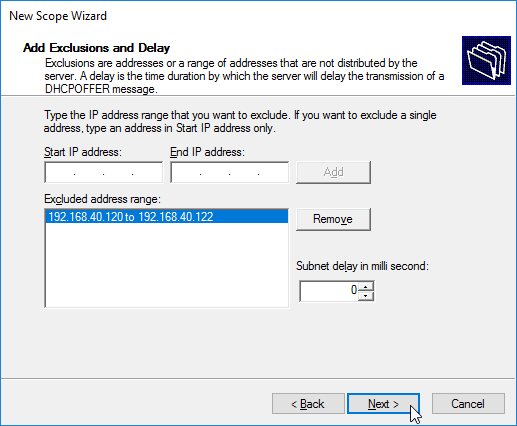
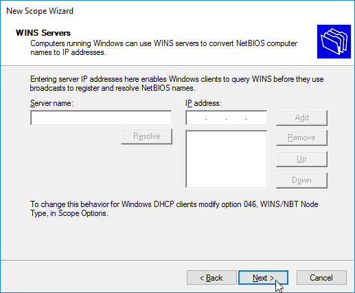

[TOC]

---
## Install DHCP 

#### We must to go in **"Control Panel\All Control Panel Items\Network and Sharing Center"** and click on **Ethernet0** Connection :

---
#### Then click on **Properties** :

---
#### Come down in **IPv4 option** and click **Properties** again  :

---
We already have a Static IP set up on this particular server, because that's the one our Network Administrator told us to use. When you go to set the Static IP for a DHCP server, it's important to talk with the Network Administrator first and find out what they would have we use inside our particular Network Environment.

#### Now go to setup the **DHCP Server**, in the Dashboard of the **"Server Manager"** click on **"Add Roles & Features"** :

---
#### This will bring up the **"Add Roles & Features Wizard"**, click **"Next"** on this :

---
#### In our case, we're doing **"Rolls and Features"** and click **"Next"** :

---
#### In this screen, if there are more than one computer available on the network to do this, then more than one server would be shown here, as it is, we only have the one server set up on this Network click **"Next"** :

---
#### Click on the role **"DHCP Server"**, a new window appears, just click **"Add Features"** and click **"Next"** :

---
#### Click **"Next"** by doing nothing :

---
#### Click **"Next"** by doing nothing :

---
#### Click **"Install"** :

---
#### Click on **"Complete DHCP Configuration"** :

---
#### A new Window appears,for complete the configuration of DHCP , click on **"Commit"** :

---
#### And **"Close"** :

---
---

## Creation of Scoop DHCP 

#### Creation of Scoop by going in Tools option, and picking our **DHCP Management Tool** :

---
#### We choose the server we want to use, then choose **IPv4** :

---
#### Click on **"Action"** and **"New Scope Wizard"** :

---
#### Click on **"Next"** :

---
#### We have to choose a name for our Scope and then click **"Next"** :

---
#### We have to put **"Start IP address"** & **"End IP address"** with subnet mask :

---
#### Now, we can put any IP addresses or IP ranges that we want to exclude :

---
#### Now we have the option of setting up the duration of our lease, the default duration is 8 days :

---
#### Click **"Next"** :

---
#### Then we have the option of entering a **Default Gateway** :

---
#### Now if we want to make our **DHCP Server** as part of a Domain or something, we would enter that information as well, since we don't have a domain to enter, we can click **"Next"** :

---
#### We also have the option of setting up a **WINS Server**, click **"Next"** :

---
#### And then click **"Next"** to activate it :

---
#### And **"Finish"** :

---
