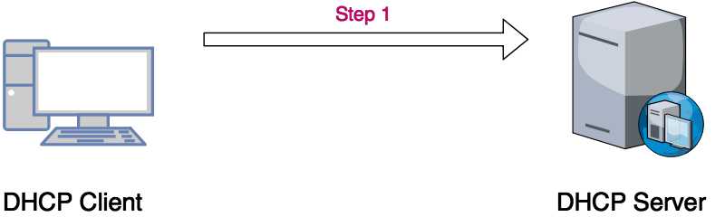

#  <a href="/windows/windows-server/windows-server-2016/dhcp" class="nav-button transform"><span></span></a>What's DHCP & How it works
---

## What's DHCP ?

```
* Stands for Dynamic Host Configuration Protocol
* Allows IP Addresses to be automatically assigned using a predefined pool
* Temporarily leases out IP Addresses for a predefined time
* Leases must be renewed after they are up
* Prevents IP address duplication by keeping track of assigned IP addresses.
```

---

## How it works ?

   {.center}


* In first we have a DHCP Client, will be a computer Workstation & a DHCP Server.

---
</br>

   {.center}

In the process of booting up :
* DHCP client will issue a DHCP discover request
* This request is issued across the MAC address, using the MAC address Broadcast address.


---
</br>

   {.center}


* Therefore, this request goes out to every device, directly connected to that segment of the network.


---
</br>

   {.center}


* Then the DHCP client sends a DHCP discover request.

---
</br>

   {.center}


* When a DHCP server on that segment hears a DHCP discover request, it then responds by sending a DHCP offer message, the DHCP offer message consists of a proposed IP address as well as other information that the client may need to properly access the Network.

* Once the DHCP client receives the DHCP offer, it then has the option of either acknowledging or accepting the offer or declining it.

* If there are more than one DHCP servers on the segment, the client will always accept the DHPC offer it receives first and it will decline any one after that.

* Once the DHCP client accepts the DHCP offer, it then issues a DHCP request message back to the DHCP server.

* The DHCP server then accepts that request message and issues a DHCP acknowledgement telling the DHCP client that "Okay, you have that IP address" along with the Gateway and any other information.

* Once the lease expires, the DHCP client goes through the whole process again in order to renew the IP it already has.
