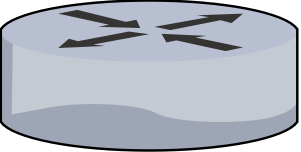

# <a href="/network/foundations-of-networking-networking-basics/5-commonly-used-network-devices" class="nav-button transform"><span></span></a>Routers

   {.center}

```
* Move data around large networks like WANs
* Primarily use Layers 3 and 4 of the OSI Model
* Are intelligent
* Make independent decisions about sending data
```

**Criteria Used to Determine Route** :
* Hops
* Network Traffic
* Network throughput
* Network reliability
* Create tables based of this information
* Update tables to always know best route


**Routers Are Programmable** :
* Have to have their interfaces configured
* Have to be told which networks they are connected to
* Have define criteria for what is not allowed though routers
* Can be programed for multiple protocols

