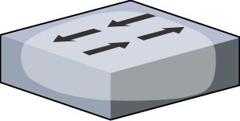

# <a href="/network/foundations-of-networking-networking-basics/5-commonly-used-network-devices" class="nav-button transform"><span></span></a>Switches

   {.center}

```
* A device used to connected multiple computers together
* Primarily works on Layer 2 of the OSI Model
* Some can work on Layer 2 as well as higher Layers
* When a switch can work on more than 1 layer, it is called a Multilayer Switch
```

**Basic Switch** :
* Most common type of switch
* Is essentially a multiport bridge
* Used to separate larger networks into smaller segments
* These segments called Collision Domains
* Uses ports to set up point-to-point connections between devices connected to the affected ports
* Results in no Collisions on network
* Allows different ports to communicate at Full-Speed
* Makes it harder to listen in to traffic on the network
* Commonly used to convert media from one type to another
* Some switches have fiber coming into them
* But send signals out over copper twisted pair wires


**Managed and Unmanaged Switches** :
* Managed switches
	* Are programmable
	* Use to control how data behaves on the network
	* Most often found in corporate environments
* Unmanaged switches
	* They generally come with a default configuration
	* Most can only be changed within predefined limits
	* Some cannot be changed at all
	* Most home or SOHO switches are unmanaged
		 


